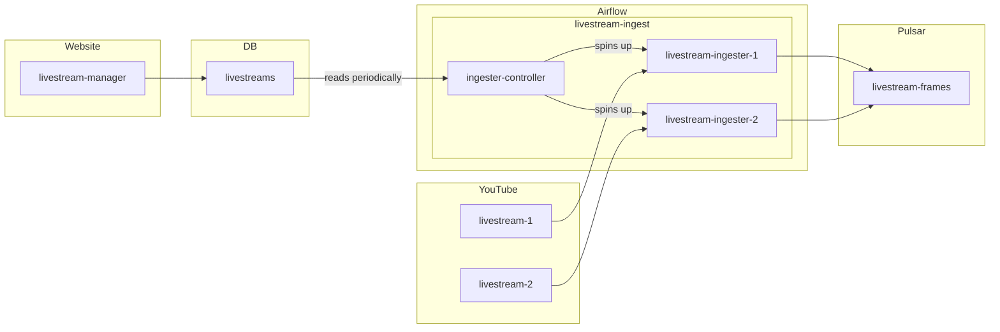

# video-stream-OR-app
Application for processing video streams and recognizing objects in them

# TODO
describe what's happening in video
give count of objects in video
record these over time in kafka
overlay box for object recognition

search for videos and add them to the stream

chunk up mp4 files and send over kafka

use confluent kafka

# Architecture
