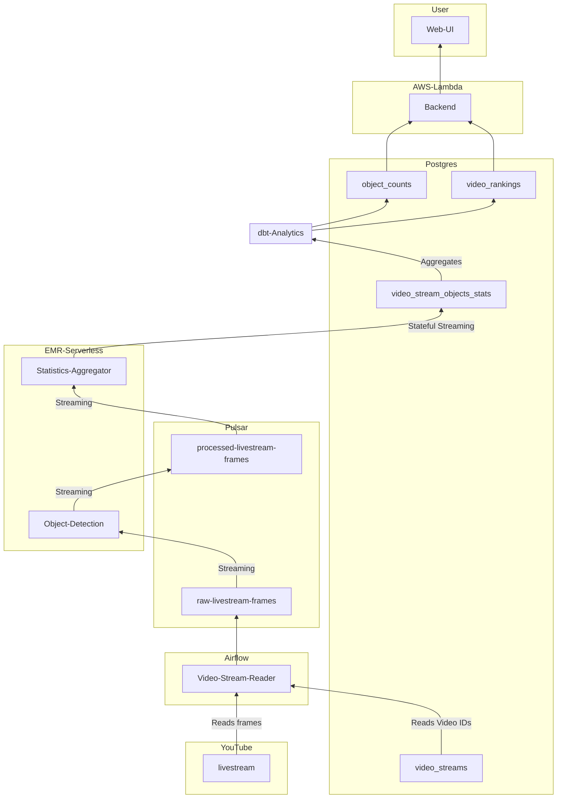

# Overview
Application for processing video streams and recognizing objects in them. The UI is available at [https://video-streams.kevin-mcquate.net](https://video-streams.kevin-mcquate.net).

# Components
## Web UI
Web frontend written in TypeScript with React and Tailwind, hosted with CloudFront. Link: [https://video-streams.kevin-mcquate.net](https://video-streams.kevin-mcquate.net). The code is available here: [frontend/](frontend/).

## Backend
Web backend written in Python with FastAPI, hosted on AWS Lambda. API available here: [https://video-streams-api.kevin-mcquate.net/docs](https://video-streams-api.kevin-mcquate.net/docs). The code is available here: [backend/](backend/).

## Postgres
Database used to store video stream metadata and analytics. Hosted on AWS RDS and managed with Terraform.

## Apache Pulsar
Apache Pulsar is similar to Kafka, but with more features. This is used for high-volume streaming of video data. 

Pulsar is being run on Docker Compose on EC2, managed by Terraform: [https://github.com/kgmcquate/infra/blob/main/video_stream/main.tf](https://github.com/kgmcquate/infra/blob/main/video_stream/main.tf)

## Apache Airflow
Airflow is used to schedule and monitor the streaming and batch jobs.

Airflow is being run on Docker Compose on EC2, managed by Terraform: [https://github.com/kgmcquate/infra/tree/main/airflow](https://github.com/kgmcquate/infra/tree/main/airflow)

## Video Stream Reader
Reads the video streams from YouTube and publishes video frames to a Pulsar topic. Runs continuously on Airflow. The code is available here: [video-stream-producer/](video-stream-producer/).

## Spark on EMR Serverless
### Image Classifier
Reads video frames from a Pulsar topic, does object detection with ML models, and writes the results to another Pulsar topic. The code is available here: [image-classifier/](image-classifier/).

### Object Statistics Aggregator
Reads object detection results from Pulsar, aggregates them to reduce data volume, and writes them to Postgres. The code is available here: [stats-aggregator/](stats-aggregator/).

## dbt Analytics
dbt models running on Postgres for analytics of the video streams. These tables are used in the web UI. Runs on Airflow with Astronomer Cosmos. The code is available here: [dbt_analytics/](dbt_analytics/).

# Architecture
